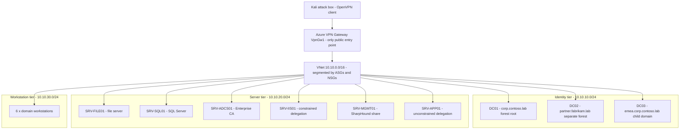

# Azure Active Directory Cyber Range

A fully automated, infrastructure-as-code Active Directory lab in Azure with
nine deliberately seeded misconfigurations, plus an attack-path engine that
ingests BloodHound output and uses an LLM to rank and explain escalation paths.

Built as a personal offensive-security portfolio project. Everything is
reproducible: one command provisions the whole range, one command destroys it.

> This range is an isolated lab you own. Nothing here is an authorisation to
> test any system you do not control.

## What you get

- **15 Windows hosts** across **2 forests + 1 child domain**, wired with a
  bidirectional forest trust (SID history enabled) for cross-forest abuse.
- **Nine seeded misconfigurations**, each independently toggleable so you can
  build a clean range and seed one path at a time for faithful BloodHound
  diffs.
- **Fully automated build**: Terraform provisions, Ansible configures, seeds
  the misconfigurations, stages SharpHound, and verifies the Kali attack box.
- **Private by default**: the only public entry point is the point-to-site VPN
  gateway. No host has a public IP.
- **An attack-path engine** that turns a BloodHound export into a ranked,
  MITRE-mapped remediation report, with or without an LLM.

## Architecture



## Domains

| Domain | NetBIOS | Role | DC |
|--------|---------|------|----|
| `corp.contoso.lab` | CORP | Forest root | DC01 |
| `partner.fabrikam.lab` | PARTNER | Second forest | DC02 |
| `emea.corp.contoso.lab` | EMEA | Child of CORP | DC03 |

## Scenario matrix

| # | Scenario | Role / toggle | MITRE ATT&CK |
|---|----------|---------------|--------------|
| 1 | Kerberoasting | `misconfig_kerberoast` | T1558.003 |
| 2 | AS-REP roasting | `misconfig_asrep` | T1558.004 |
| 3 | Unconstrained delegation + coercion | `misconfig_unconstrained_delegation` | T1558, T1187 |
| 4 | Constrained delegation / protocol transition | `misconfig_constrained_delegation` | T1558, T1550.003 |
| 5 | AD CS ESC1 / ESC8 | `misconfig_adcs` | T1649, T1557.001 |
| 6 | Cross-forest trust abuse (SID history) | `misconfig_trust_abuse` | T1134.005 |
| 7 | ACL abuse (GenericAll on an OU, shadow creds) | `misconfig_acl` | T1222, T1098 |
| 8 | DCSync replication rights | `misconfig_dcsync` | T1003.006 |
| 9 | SYSVOL GPP cpassword (bonus) | `misconfig_sysvol` | T1552.006 |

Per-scenario walkthroughs live in `docs/scenarios/`.

## Cost

The 15-host topology runs at roughly **$2.36/hour** (VPN gateway on, Bastion
off). A realistic build → seed → test → record → destroy cycle fits in
**$25–60** of the $200 free-trial credit. Read `docs/cost.md` before applying.
Auto-shutdown is on by default, but **only `terraform destroy` stops disk
billing** — always destroy when you are done.

`terraform output estimated_hourly_cost_usd` prints the live estimate.

## Prerequisites

- Azure CLI authenticated against a subscription with free-trial credit
  (`az login`, confirm `az account show`).
- Terraform >= 1.6, Ansible >= 2.15 with the `ansible.windows`,
  `community.windows`, and `community.general` collections.
- An OpenVPN client on the attack box and the VPN root certificate downloaded
  once the gateway is up.

## Build and run

```bash
# 1. Configure
cp .env.example .env                       # local secrets, git-ignored
cp terraform/terraform.tfvars.example terraform/terraform.tfvars

# 2. Preflight: checks auth, tooling, and prints the cost estimate
./scripts/preflight.sh

# 3. Provision (prompts for "apply", then runs terraform init/plan/apply)
./scripts/deploy.sh

# 4. Configure the range and seed misconfigurations
ansible-playbook -i ansible/inventory/hosts.yml ansible/site.yml

# 5. Connect the Kali box over VPN, then collect + analyse
#    (SharpHound is staged on SRV-MGMT01)
sudo openvpn --config ~/azure-vpn/corp.ovpn &

# 6. Analyse with the attack-path engine
cd attack-path-engine
ap-engine analyze --bloodhound /path/to/range-bloodhound.zip --out ./reports

# 7. DESTROY when finished (this is the important one)
./scripts/destroy.sh
```

Select a subset of the build with Ansible tags:

```bash
ansible-playbook -i ansible/inventory/hosts.yml ansible/site.yml --tags kerberoast
ansible-playbook -i ansible/inventory/hosts.yml ansible/site.yml --skip-tags misconfig
```

## The attack-path engine

Given a BloodHound export, the engine:

1. normalises the export into a graph,
2. resolves SPN delegation targets and propagates OU/container ACEs,
3. marks Tier 0 (Domain Admins, DCs, domains, high-value groups),
4. finds cheapest escalation paths from a foothold with Dijkstra,
5. collects attribute findings (Kerberoast, AS-REP, delegation, ADCS, ACLs),
6. optionally asks an LLM to re-rank and explain the paths, then
7. renders a Markdown, HTML, and JSON report.

It runs with no API key (deterministic scoring only) and degrades gracefully if
the LLM call fails. See `attack-path-engine/README.md` for full details.

## Repository layout

```
terraform/            Azure infrastructure (network, VPN, Key Vault, 15 VMs)
ansible/              Configuration: forests, trusts, joins, 9 misconfig roles
attack-path-engine/   Python BloodHound analysis + LLM ranking engine
docs/cost.md          Mandatory pre-apply cost model
docs/scenarios/       Per-scenario walkthroughs
docs/runbook.md       Step-by-step build/verify/record/destroy runbook
scripts/              preflight, deploy, destroy, generate-inventory
screenshots/          Captured evidence for the write-up
```

## Secrets

Secrets are never committed. Generate admin credentials in Azure Key Vault
(default) or supply them via the git-ignored `.env` / `terraform.tfvars`. The
engine reads only its own project-scoped `USER_LLM_*` variables and never the
coding agent's platform credentials.

## Destroy reminder

This range bills by the hour while it exists. When you stop working — even for
the day — run `./scripts/destroy.sh` and confirm with `az group list -o table`.
